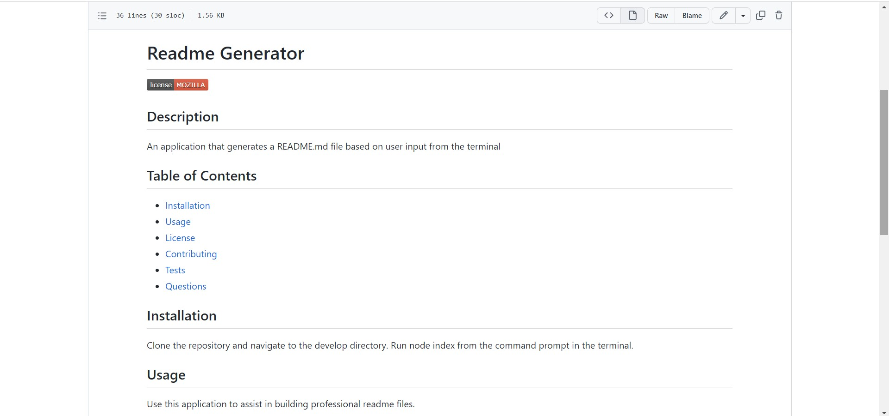

# Readme Generator

## Description
An application that generates a README.md file based on user input from the terminal
## Table of Contents
- [Installation](#installation)
- [Usage](#usage)
- [License](#license)
- [Contributing](#contributing)
- [Tests](#tests)
- [Questions](#questions)
## Installation
Clone the repository and navigate to the develop directory.  Run node index from the command prompt in the terminal.
## Usage
Use this application to assist in building professional readme files.

## License
Mozilla

Permissions of this weak copyleft license are conditioned on making available source code of licensed files and modifications of those files under the same license (or in certain cases, one of the GNU licenses). Copyright and license notices must be preserved. Contributors provide an express grant of patent rights. However, a larger work using the licensed work may be distributed under different terms and without source code for files added in the larger work.
## Contributing
To be added to this project as a contributor, send me an email.
## Tests
To test this application, run in the terminal, open the readme.md from the develop folder.  Press ctrl+shift+v to see a preview.
## Questions
The link to my Github profile is:

[tarajevans](https://github.com/tarajevans)

For any questions or comments please email me:
tarajevans@hotmail.com

The deployed link for this project is here:
https://github.com/tarajevans/readme-generator/blob/main/Develop/README.md
